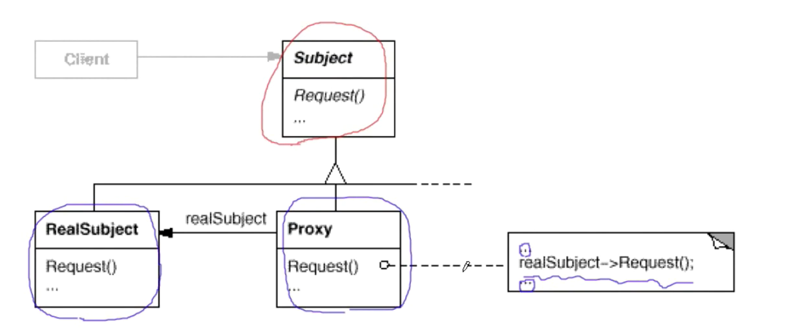

## 代理模式

#### 动机

1. 在面向对象系统中，有些对象由于某种原因(比如对象创建的开销很大，或者某些操作需要安全控制，或者需要进程外的访问等)，直接访问会给使用者、或者系统结构带来很多麻烦。
2. 如何在不失去透明操作对象的同时来管理/控制这些对象特有的复杂性？增加一层间接层是软件开发中常见的解决方式。

#### 定义

为其他对象提供一种代理以控制（隔离，使用接口）对这个对象的访问。

#### UML 类图

#### 要点总结

> 1. "增加一层间接层”是软件系统中对许多复杂问题的一种常见解决方法。在面向对象系统中直接使用某些对象会带来很多问题，作为间接层的 proxy 对象便是解决这一问题的常用手段。
> 2. 具体 proxy 设计模式的实现方法、实现粒度都相差很大,有些可能对单个对象做细粒度的控制，如 copy-on-write 技术,有些可能对组件模块提供抽象代理层，在架构层次对对象做proxy。
> 3. Proxy并不一定要求保持接口完整的一致性，只要能够实现间接控制，有时候损及一些透明性是可以接受的。

