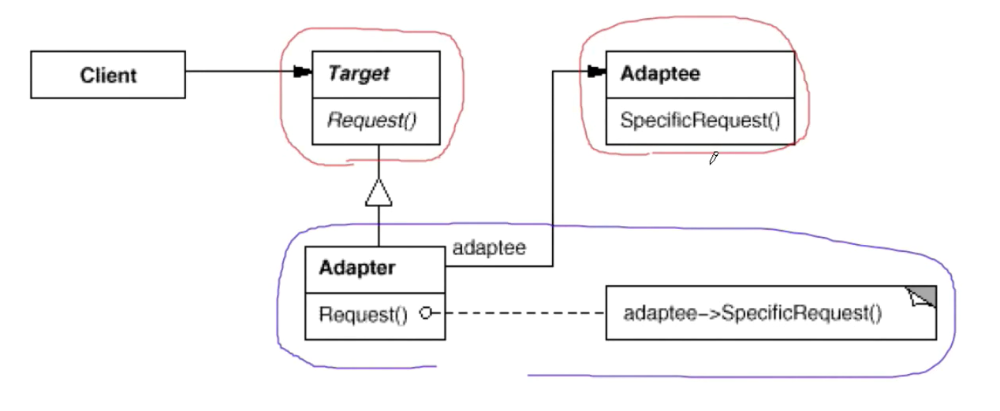

## 适配器模式

#### 动机

1. 在软件系统中，由于应用环境的变化，常常需要将”一些现存的对象“放在新的环境中应用，但是新环境要求的接口是这些现存对象所不满足的。
2. 如何应对这种“迁移的变化” ？如何既能利用现有对象的良好实现，同时又能满足新的应用环境所要求的接口？

#### 身边的适配器

转接头、电源适配器等

#### 定义

将一个类的接口转换成客户希望的另一个接口。Adapter 模式使得原本由于接口不兼容而不能一起
的那些类可以一起工作。

#### 代码

典型：STL 中 stack 和 queue 严格叫做适配器，默认利用 deque 实现。

```c++
stack<int, vector<int>> stk;

queue<int, vector<int>> q;
```


#### UML 类图



#### 要点总结

> 1. Adapter模式主要应用于“希望复用一些现存的类，但是接口又与复用环境要求不一致的情况”,，在**遗留代码复用、类库迁移等方面**非常有用。
> 2. GoF 23 定义了两种Adapter模式的实现结构：对象适配器和类适配器。但**8类适配器采用" 多继承”的实现方式，一般不推荐使用**。对象适配器采用“对象组合”的方式,更符合松耦合精神。
> 3. Adapter模式可以实现的非常灵活，不必拘泥于 Gof 23 中定义的两种结构。例如完全可以将Adapter模式中的 ”现存对象” 作为新的接口方法参数，来达到适配的目的。

