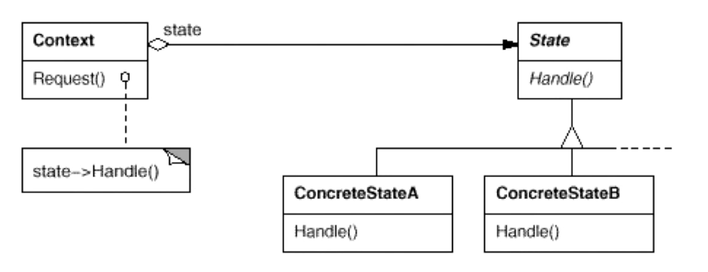

## 状态模式

#### 动机

1. 在软件构建过程中，某些对象的状态如果改变，其行为也会随之而发生变化，比如文档处于只读状态，其支持的行为和读写状态支持的行为就可能完全不同。
2. 如何在运行时根据对象的状态来透明地更改对象的行为？而不会为对象操作和状态转化之间引入紧耦合？

#### 定义

允许一个对象在其内部状态改变时改变它的行为。从而使对象看起来似乎修改了其行为。

#### UML 类图

#### 要点总结

> 1. State 模式将所有与一个特定状态相关的行为都放入一个 State 的子类对象中，在对象状态切换时，切换相应的对象；但同时维持 State 的接口，这样实现了具体操作与状态转换之间的解耦。
> 2. 为不同的状态引入不同的对象使得状态转换变得更加明确，而且可以保证不会出现状态不一致的情况,因为转换是原子性的一即要么彻底转换过来，要么不转换。
> 3. 如果 State 对象没有实例变量，那么各个上下文可以共享同一个 State 对象,从而节省对象开销。

