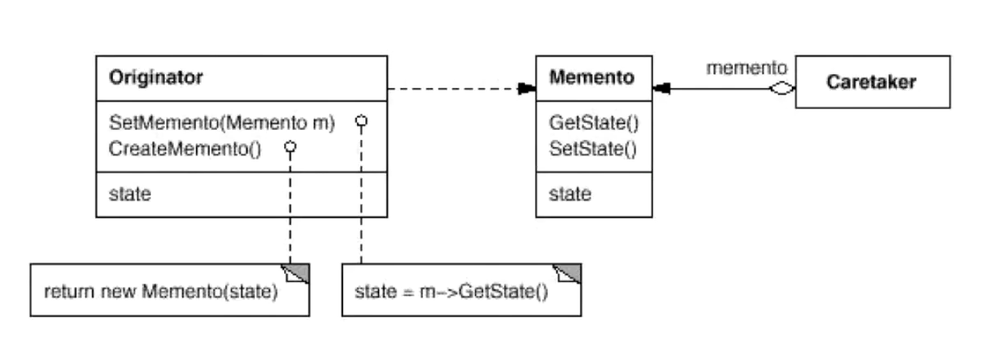

## 备忘录

#### 动机

1. 在软件构建过程中，某些对象的状态在转换过程中，可能由于某种需要，要求程序能够回溯到对象之前处于某个点时的状态。如果使用一些公有接口来让其他对象得到对象的状态，便会暴露对象的细节实现。
2. 如何实现对象状态的良好保存与恢复？但同时又不会因此而破坏对象本身的封装性？

#### 定义

在不破坏封装性的前提下，捕获一个对象的内部状态，并在该对象之外保存这个状态。这样以后就可以将该对象恢复到原先保存的状态。

#### 代码示意

```c++
#include <string>
using std::string;

class Memento
{
    string state;
    //..    状态
public:
    Memento(const string &s) : state(s) {}

    string getState() const
    {
        return state;
    }

    void setState(const string &s)
    {
        state = s;
    }
};

class Originator
{
    string state;
    //.... 状态
public:
    Originator() {}
    Memento createMomento()
    {
        Memento m(state); // 创建一个状态 并返回对象（保存当前状态）
        return m;
    }
    void setMomento(const Memento &m)
    {
        state = m.getState();
    }
};

int main()
{
    Originator orginator;

    //捕获对象状态，存储到备忘录
    const Memento mem = orginator.createMomento();

    //... 改变orginator状态

    //从备忘录中恢复
    orginator.setMomento(mem);

    return 0;
}
```


#### UML 类图



#### 要点总结

> 1. 备忘录( Memento )存储原发器( Originator )对象的内部状态，在需要时恢复原发器状态。
> 2. Memento 模式的 **核心是信息隐藏**，即 Originator 需要向外接隐藏信息，保持其封装性。但同时又需要将状态保持到外界( Memento )。
> 3. 由于现代语言运行时(如C#、Java等)都具有相当的 **对象序列化** 支持，因此往往采用效率较高、又较容易正确实现的序列化方案来实现Memento模式。

