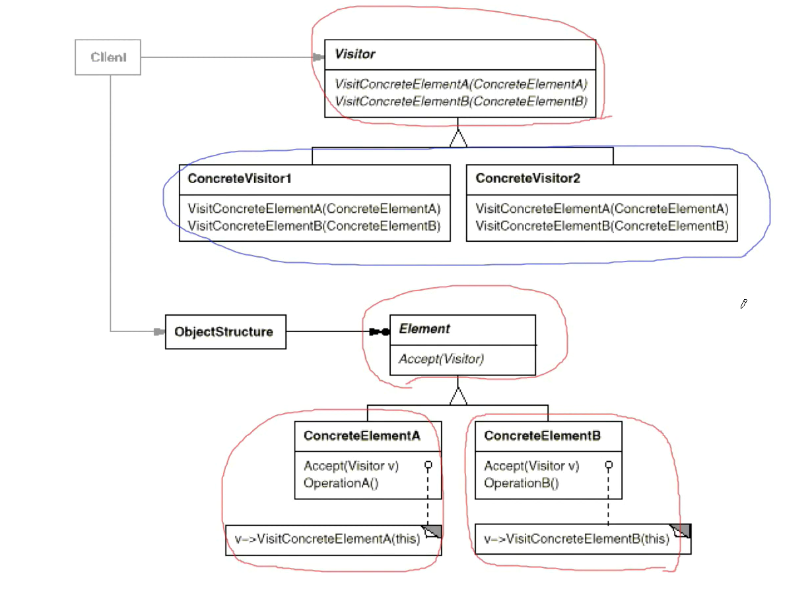

## 访问器模式

#### 动机

1. 在软件构建过程中，由于需求的改变,某些类层次结构中常常需要增加新的行为(方法) , 如果直接在基类中做这样的更改,将会给子类带来很繁重的变更负担,甚至破坏原有设计。
2. 如何在不更改类层次结构的前提下,在运行时根据需要透明地为类层次结构_上的各个类动态添加新的操作,从而避免上述问题?

#### 定义

表示一个作用于某对象结构中的各元素的操作。使得可以在不改变(稳定)各元素的类的前提下定义(扩展)作用于这些元素的新操作(变化)。

#### UML 类图

#### 要点总结

> 1. Visit模式通过所谓双重分发(double disath)来实现在不更改(不添加新的操作——编译时）Element 类层次结构前提下，在运行时透明地为类层次结构上的各个类动态添加新的操作（支持变化）。
> 2. 所谓双重分发即 Visitor 模式中间包括了两个多态分发（注意其中的多态机制）：第一个为 accept 方法的多态辨析；第二个为 visitElement 方法的多态辨析。
> 3. Visitor 模式的最大确定在于扩展类层次结构（增添新的 Element 子类），会导致 Visitor 类的改变。因此 Visitor 模式适用于 ”Element 类层次结构稳定，为其中的操作却经常面临频繁改动“。