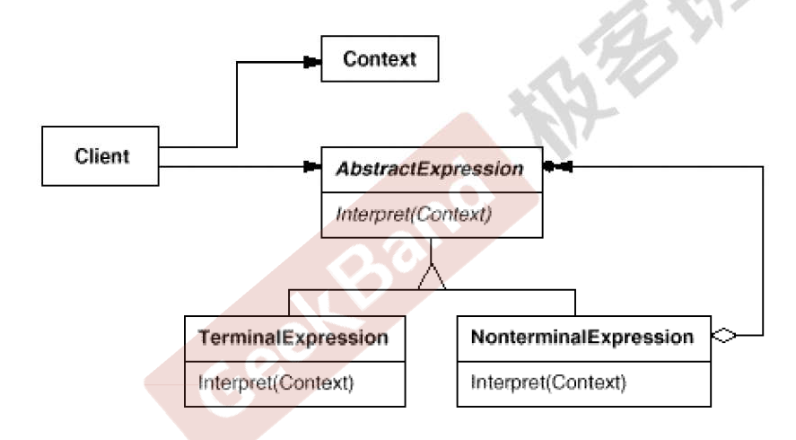

## 解析器模式

### “领域规则”模式

1. 在特定领域中，某些变化虽然频繁，但可以抽象为某种规则。这时候，结合特定领域，将问题抽象为语法规则，从而给出在该领域下的一般性解决方案。
2. 典型模式：Interpreter

#### 动机

1. 在软件构建过程中，如果某一特定领域的问题比较复杂，类似的结构不断重复出现，如果使用普通的编程方式来实现将面临非常频繁的变化。
2. 在这种情况下，将特定领域的问题表达为某种语法规则下的句子，然后构建一个解释器来解释这样的句子，从而达到解决问题的目的。

#### 定义

给定一个语言，定义它的文法的一种表示，并定义一种解释器，这个解释器使用该表示来解释语言中的句子。

#### UML 类图

#### 要点总结

> 1. Interpreter模式的应用场合是 Interpreter 模式应用中的难点，只有满定“业务规则频繁变化，且类似的结构不断重复出现，并且容易抽象为语法规则的问题”才适合使用 Interpreter模式。
> 2. 使用 Interpreter 模式来表示文法规则，从而可以使用面向对象技巧来方便地"扩展”文法。
> 3. Interpreter 模式**比较适合简单的文法表示**，*对于**复杂的文法**表示 Interperter 模式会产生比较大的类层次结构，需要求助于语法分析生成器这样的标准工具*。

