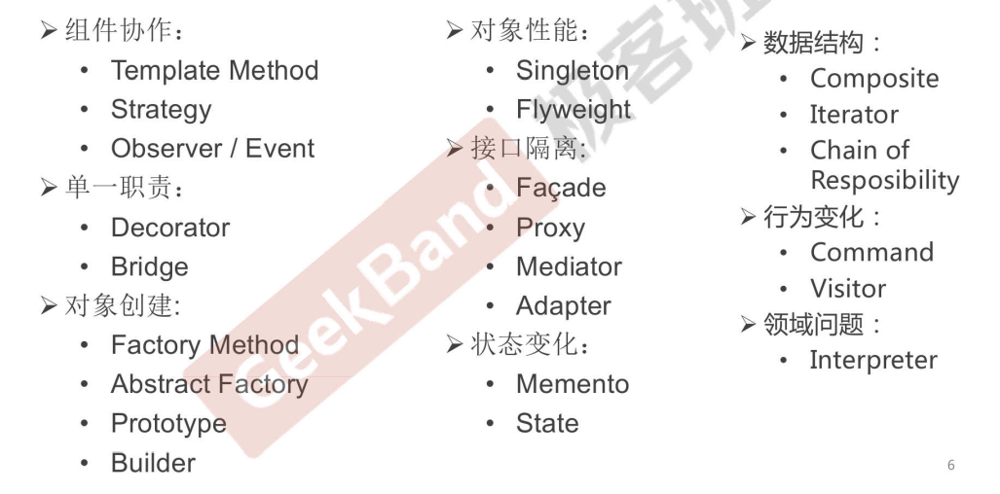
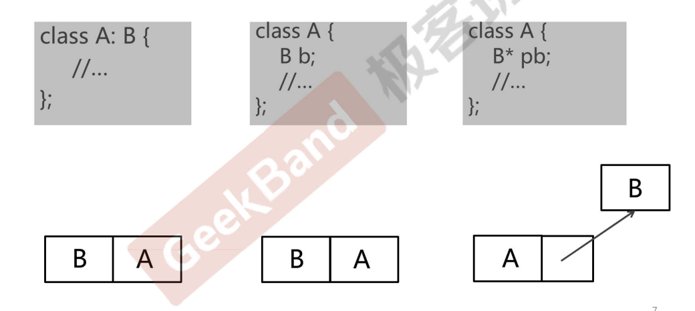

## 设计模式总结

#### 一个目标

**管理变化，提高复用**

#### 两种手段

**分解** 和 **抽象**

#### 八大原则

1. **依赖倒置原则（DIP）**： 高层模块(稳定)不应该依赖于低层模块(变化)，二者都应该依赖于抽象(稳定) ；抽象(稳定)不应该依赖于实现细节(变化) ，实现细节应该依赖于抽象(稳定)。
2. **开放封闭原则（OCP）**：对扩展开放，对更改封闭。 类模块应该是可扩展的，但是不可修改。
3. **单一职责原则（SRP）**： 一个类应该仅有一个引起它变化的原因。变化的方向隐含着类的责任。
4. **Liskov 替换原则（LSP）**：子类必须能够替换它们的基类(IS-A)。继承表达类型抽象。
5. **接口隔离原则（ISP）**： 不应该强迫客户程序依赖它们不用的方法。 接口应该小而完备。
6. **优先使用对象组合，而不是类继承**：类继承通常为“白箱复用”，对象组合通常为“黑箱复用”。 继承在某种程度上破坏了封装性，子类父类耦合度高。而对象组合则只要求被组合的对象具有好定义的接口，耦合度低。
7. **封装变化点**： 使用封装来创建对象之间的分界层，让设计者可以在分界层的一侧进行修改，而不会对另一侧产生不良的影响，从而实现层次间的松耦合。
8. **针对接口编程，而不是针对实现编程**： 不将变量类型声明为某个特定的具体类，而是声明为某个接口。 客户程序无需获知对象的具体类型，只需要知道对象所具有的接口。 减少系统中各部分的依赖关系，从而实现“高内聚、松耦合”的类型设计方案。

#### 重构技法

1. 静态 -> 动态
2. 早绑定 -> 晚绑定
3. 继承 -> 组合
4. 编译时依赖 -> 运行时依赖
5. 紧耦合 -> 松耦合

#### 从封装变化角度对模式分类

#### C++ 对象模型

第 3 中结构在设计模式中最常见。

#### 关注变化点和稳定点

#### 什么时候不用模式

1. 代码可读性很差时
2. 需求理解还很浅时
3. 变化没有显现时
4. 不是系统的关键依赖点
5. 项目没有复用价值时
6. 项目将要发布时

#### 经验之谈

1. 不要为模式而模式
2. 关注**抽象类&接口**
3. 理清变化点和稳定点
4. 审视依赖关系
5. 要有 Framework 和 Application 的区隔思维
6. 良好的设计是演化的结果

#### 设计模式成长之路

1. “手中无剑,心中无剑”：见模式而不知
2. "手中有剑,心中无剑”：可以识别模式，作为应用开发人员使用模式
3. “手中有剑,心中有剑”：作为框架开发人员为应用设计某些模式
4. “手中无剑,心中有剑”：忘掉模式，只有原则

