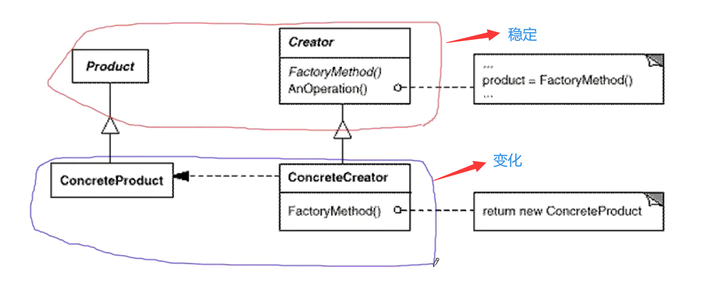

# 工厂方法模式

### 对象创建模式

1. 通过“对象创建” 模式绕开new，来避免对象创建（new）过程中所导致的紧耦合（依赖具体类），从而支持对象创建的稳定。它是接口抽象之后的第一步工作。

2. **典型模式**

   • Factory Method
   • Abstract Factory
   • Prototype
   • Builder

#### **动机**

> 1. 在软件系统中，经常面临着创建对象的工作；由于需求的变化，需要创建的对象的具体类型经常变化。
> 2. 如何应对这种变化？**如何绕过常规的对象创建方法(new)，提供一种“封装机制”来避免客户程序和这种“具体对象创建工作”的紧耦合？**

#### **模式定义**

定义一个**用于创建对象的接口**，让子类决定实例化哪一个类。**Factory Method使得一个类的实例化延迟（目的：解耦，手段：虚函数）到子类**。

#### **UML 类图**

#### 要点总结

> 1. Factory Method模式用于隔离类对象的使用者和具体类型之间的耦合关系。面对一个经常变化的具体类型，紧耦合关系(new)会导致软件的脆弱。
> 2. Factory Method模式通过**面向对象的手法**，将所要创建的具体对象工作**延迟**到子类，从而实现一种扩展（而非更改）的策略，较好地解决了这种紧耦合关系。
> 3. Factory Method模式解决“单个对象”的需求变化。缺点在于要求创建方法/参数相同。