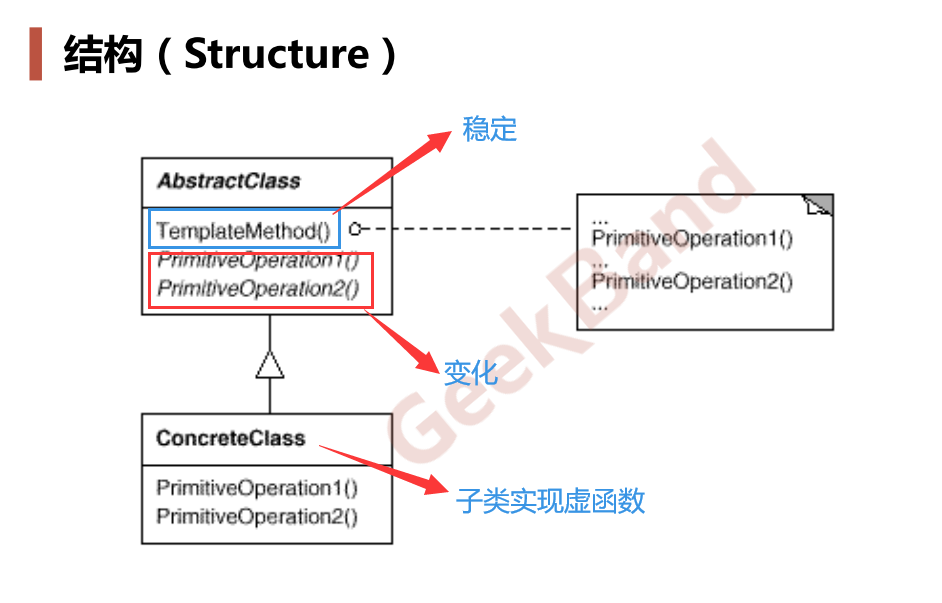

# 模板方法

### 重构关键技法

1. 静态 -> 动态
2. 早绑定 -> 晚绑定
3. 继承 -> 组合
4. 编译时依赖 -> 运行时依赖
5. 紧耦合 -> 松耦合

### “组件协作”模式

典型模式：

> 1. Template Method
> 2. Strategy
> 3. Observer / Event

## 模板方法

**定义**：定义一个操作中的算法的**骨架（稳定）**，而将一些步骤**延迟（变化）到子类中**。Template Method 使得子类可以不改变（复用）一个算法的结构即可重定义(override 重写)该算法的某些特定步骤。

**关键**：区分软件中哪些部分是稳定（变化频率小）的？哪些部分是不稳定的？

**UML 图**

**要点总结**

> 1. Template Method模式是一种非常基础性的设计模式，在面向对象系统中有着大量的应用。它用最简洁的机制（虚函数的多态性）为很多应用程序框架提供了灵活的扩展点，是代码复用方面的基本实现结构。
> 2. 除了可以灵活应对子步骤的变化外，“不要调用我，让我来调用你”的反向控制结构是 Template Method 的典型应用。
> 3. 在具体实现方面，被 Template Method 调用的虚方法可以具有实现，也可以没有任何实现（抽象方法、纯虚方法），但一般推荐将它们设置为 protected 方法。
